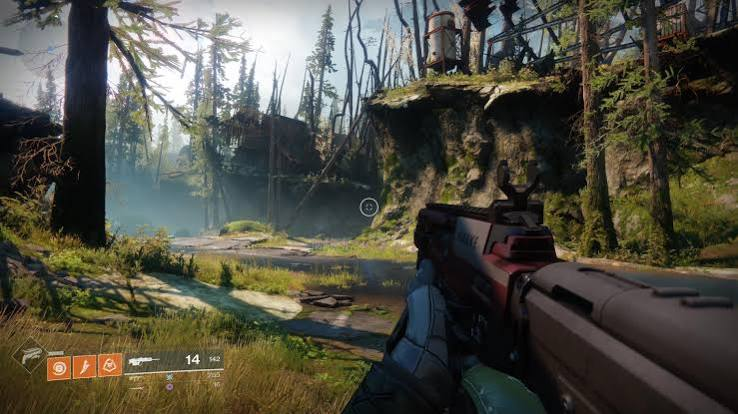

# Destiny 2

## Overview

I have been playing Destiny 2 for about at least 7 years, and it is one of my favorite games because there is always something new to work toward. I like that the game combines shooting with a science fiction story, making every mission feel different. Whether I'm completing story missions, fighting through strikes, or trying to earn better gear, I always feel like I'm making progress. I mostly enjoy playing with friends because working together makes difficult missions much easier and more fun. Although I am very conscience that Destiny is always coming out with new expansions and I've spent tons of money buying gear and well the expansions too. 

## Gameplay

### Missions and Combat

In Destiny 2, you play as a Guardian who protects humanity from different alien enemies. As you complete missions, you unlock new weapons, armor, and abilities that make your character stronger. The game includes story missions, cooperative strikes, raids, and competitive multiplayer modes.

### What I Enjoy

My favorite part of Destiny 2 is collecting new weapons and armor. I also like trying different subclasses because each one has unique abilities that change how you play. Playing with friends is another reason I keep coming back since teamwork is important during harder activities.

## Features I Like

- Fast-paced combat
- Cooperative missions
- Different character classes
- Collecting powerful gear
- Playing with friends

> "Destiny 2 keeps me interested because there is always another goal to work toward."

#### Image

The image above shows a Guardian exploring one of Destiny 2's planets.

## Related Games

Destiny 2 focuses more on teamwork and completing missions than [[fortnite]], but both games reward good teamwork. When I want something more creative, I usually play [[minecraft]] instead.

#### Tips
I cant really say any tips because the game itself is having a certain light power to pass certain levels, but when you do any multiplayer games join missions with people who have a higher light power. You could earn rewards to boost your light up as well.
