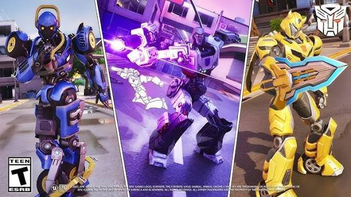

# Fortnite

## Overview

I have been playing Fortnite for about 7 years, and it is one of the games I play the most with my friends. I like that every match feels different because you never know where you'll land, what weapons you'll find, or who you'll run into. The game is always getting updates, so there is usually something new to check out, like new locations, game modes, or characters. Even after playing for a while, it still feels fun because there is always a reason to come back.

## Gameplay

### Battle Royale

The main goal in Fortnite is to be the last player or team left standing. You start by jumping from the Battle Bus onto the island, where you collect weapons, shields, and supplies while staying inside the safe zone. As the match goes on, the storm gets smaller, making players move closer together.

### What I Enjoy

My favorite part of Fortnite is playing with friends. We usually work together, share loot, and try to win matches as a team. I also enjoy building because it adds another challenge to the game and lets players protect themselves or reach higher places during a fight.

## Features I Like

- Playing with friends
- Building during battles
- Finding better weapons and gear
- Completing quests and challenges
- Trying new updates each season

> "Fortnite stays fun because every match is different, and there is always something new to try."

#### Image

## Related Games

Fortnite is more competitive than [[minecraft]], but both games let players be creative in different ways. If I want a more relaxed experience, I usually play [[minecraft]]. When I want to explore a huge open world instead of competing against other players, I like playing [[the-legend-of-zelda-tears-of-the-kingdom]].

#### Tips

Try not to get killed. That goes for me :) Have fun and build on!