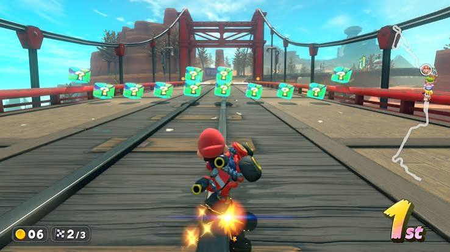

# Mario Kart World

## Overview

I started playing Mario Kart World because I have always liked racing games, and this one feels like a fun upgrade to the older Mario Kart games. It is easy to learn, but it still takes practice if you want to win races consistently. I usually play with my friends because it makes the races more competitive and entertaining. One thing I like is that every race feels different depending on the track, the items you get, and how everyone else is driving.

## Gameplay

### Racing

The main goal is to finish each race in first place while using items to help yourself or slow down other racers. There are many different tracks with unique shortcuts, obstacles, and challenges. Learning the tracks and knowing when to use your items can make a big difference.

### What I Enjoy

My favorite part of Mario Kart World is playing multiplayer. Racing against friends is always exciting because anything can happen during the last lap. I also enjoy trying different characters and karts to see which combinations work best for my driving style.

## Features I Like

- Multiplayer races with friends
- A variety of colorful tracks
- Different characters to choose from
- Fun power-up items
- Easy to learn but challenging to master

> "Mario Kart World is one of those games where every race can end differently, which keeps it fun."

#### Image

The image above shows a race taking place in Mario Kart World.

## Related Games

When I want a competitive game, I enjoy playing [[fortnite]]. If I want to build and explore instead of racing, I usually play [[minecraft]]. Mario Kart World is different from both because it focuses on fast-paced racing and having fun with friends.

#### Tips 
When turning skid left or right to increase boost when releasing. 